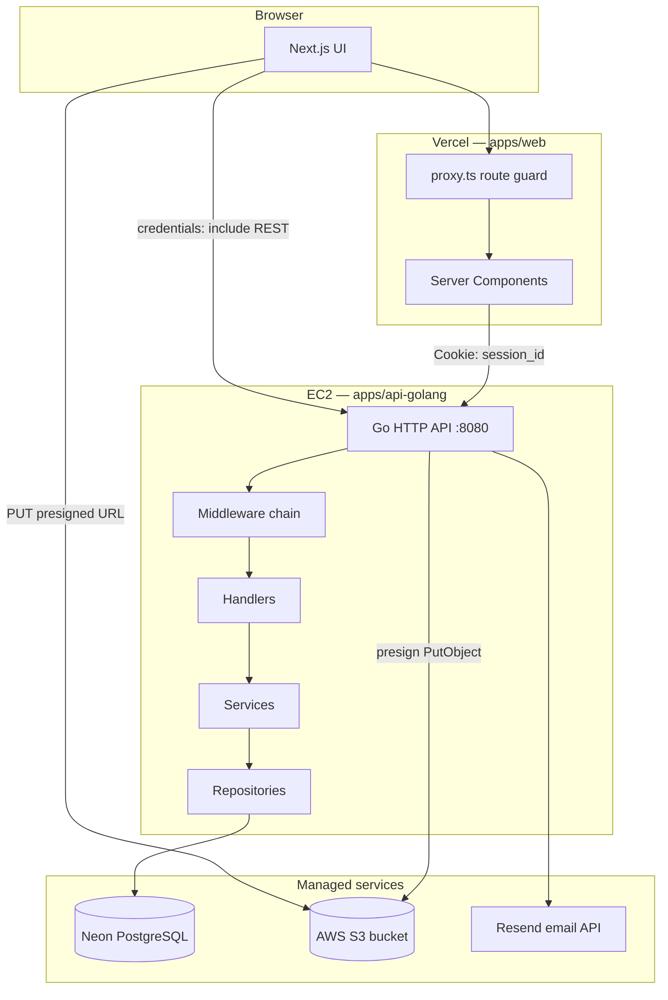
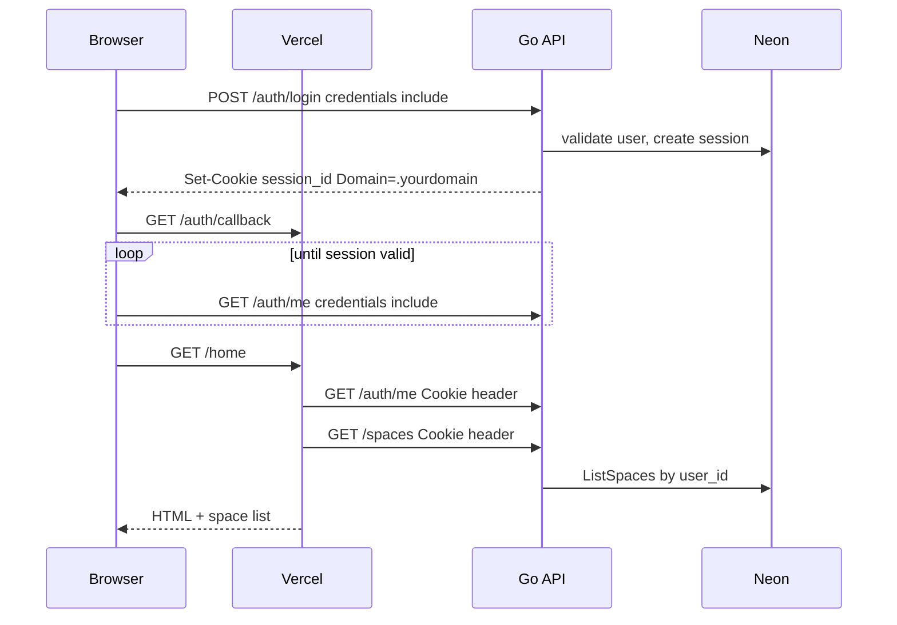
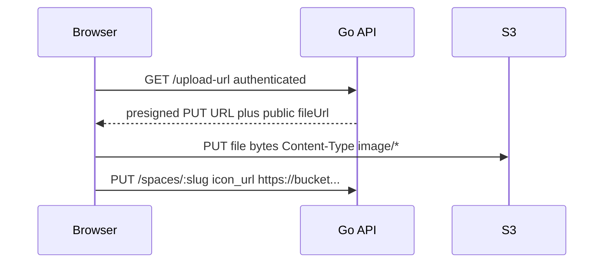

# Epsilon

Epsilon is a block-based workspace for notes, canvases, and lightweight project boards. Users authenticate, create **spaces**, and arrange **blocks** (text, markdown, images, code, todos) on a drag-and-drop canvas.

This repository is a **Turborepo monorepo**: a Next.js frontend, a Go REST API, PostgreSQL, object storage for uploads, and shared packages.

## System overview

Production is split across three hosts. The browser talks to Vercel for HTML and to EC2 for JSON. Sessions are cookie-based and stored in Postgres. Images go to S3 via short-lived presigned URLs.



| Component | Runtime | Role |
|-----------|---------|------|
| `apps/web` | Vercel | UI, canvas, auth pages, SSR data loading, `proxy.ts` session gate |
| `apps/api-golang` | EC2 (systemd) | Auth, spaces, blocks, sessions, OAuth, upload presign |
| PostgreSQL | Neon | Users, sessions, spaces, blocks |
| S3 | AWS | Space icons and block images (private bucket, HTTPS URLs) |
| `packages/emails` | Local / internal | React Email templates and render service |

Backend layering: **handler → service → repository → sqlc**.

## Request flows

### Sign-in (email / password)



### Image upload



## Repository layout

```text
apps/
  web/                      Next.js 16 frontend
    app/                    App Router pages
    features/               Dashboard, canvas, auth UI
    lib/                    api.ts, server-api.ts, spaces, upload
    proxy.ts                Protected route cookie check
  api-golang/               Go 1.26 REST API
    cmd/server/             HTTP entrypoint
    internal/
      handler/              HTTP adapters
      service/              Business rules
      repository/           Persistence
      middleware/           Auth, CORS, rate limit, security headers
      db/                   Migrations, sqlc, connection helpers
packages/
  ui/                       Shared React components
  emails/                   Email templates + render server
docker-compose.yml          Local PostgreSQL only
turbo.json                  Turborepo pipeline
.github/workflows/          CI
```

## Prerequisites

| Tool | Version | Notes |
|------|---------|--------|
| Node.js | ≥ 18 | Frontend and tooling |
| Yarn | 1.22.x | Package manager |
| Go | 1.26+ | API server |
| Docker | Latest | Local PostgreSQL |
| golang-migrate | Latest | `yarn db:migrate` |
| sqlc | Latest | `yarn db:generate` |

Optional: `pg_dump` (`yarn db:schema`), `psql` for manual inspection.

See [CONTRIBUTING.md](CONTRIBUTING.md) for install commands.

## Quick start (local)

```bash
git clone <repo-url>
cd epsilon-app
yarn install

cp apps/api-golang/.env.example apps/api-golang/.env.local
cp apps/web/.env.example apps/web/.env.local

yarn db:up
yarn db:sync
yarn db:seed          # optional demo data

yarn dev
```

| Service | URL |
|---------|-----|
| Web | http://localhost:3000 |
| API | http://localhost:8080 |
| Health | http://localhost:8080/health |
| Swagger (dev only) | http://localhost:8080/swagger/ |
| Email render | http://localhost:3001 |

## Environment variables

Configuration is **per application**. There is no shared root `.env` for secrets.

| File | Copy to | Purpose |
|------|---------|---------|
| [`apps/api-golang/.env.example`](apps/api-golang/.env.example) | `.env.local` (dev) or `.env` (EC2) | Database, OAuth, Resend, S3, URLs |
| [`apps/web/.env.example`](apps/web/.env.example) | `.env.local` (Vercel) | `API_URL`, `NEXT_PUBLIC_API_URL`, assets |

Root DB scripts read **`apps/api-golang/.env.local`**.

### Web (Vercel)

```env
NEXT_PUBLIC_API_URL=https://api.yourdomain.com
API_URL=https://api.yourdomain.com
```

`API_URL` and `NEXT_PUBLIC_API_URL` **must be identical** in production. Server Components use `API_URL`; the browser uses `NEXT_PUBLIC_API_URL`.

### API (EC2)

```env
ENV=production
DATABASE_URL=postgres://...@ep-xxx-pooler....neon.tech/neondb?sslmode=require
FRONTEND_URL=https://yourdomain.com
BACKEND_URL=https://api.yourdomain.com
COOKIE_SECURE=true
TRUST_PROXY=true
COOKIE_DOMAIN=.yourdomain.com
RESEND_API_KEY=...
GOOGLE_CLIENT_ID=...
GOOGLE_CLIENT_SECRET=...
GITHUB_CLIENT_ID=...
GITHUB_CLIENT_SECRET=...
AWS_REGION=us-east-1
S3_BUCKET=your-bucket
AWS_ACCESS_KEY_ID=...
AWS_SECRET_ACCESS_KEY=...
EMAIL_RENDER_URL=http://127.0.0.1:3001
```

Do **not** run `yarn db:seed` in production.

### Database (Neon)

The API uses **pgx** with `prefer_simple_protocol=true` when the host is Neon or a pooler. That avoids Postgres error `08P01` (`bind message has N result formats but query has M columns`) caused by transaction-mode poolers reusing connections with stale prepared statement metadata.

If you still see `ListSpaces error: pq: bind message...` after deploy:

1. Confirm migrations `000003` and `000004` ran on the production database (`description`, `icon_url` on `spaces`).
2. Restart the API after deploy so connection pools reset.
3. Prefer the Neon **pooler** host in `DATABASE_URL` for EC2; the code appends `prefer_simple_protocol=true` automatically.

## Authentication

| Mechanism | Detail |
|-----------|--------|
| Session | `session_id` HttpOnly cookie, 7-day TTL, row in `sessions` |
| Password | Argon2id |
| OAuth | Google and GitHub; callback redirects to `/auth/callback` |
| Web guard | `proxy.ts` requires cookie on `/home` and `/spaces/*` |
| API guard | `AuthMiddleware` on mutating and private reads |

Cookie attributes in production: `Secure`, `SameSite=None`, domain from `COOKIE_DOMAIN` or derived from `FRONTEND_URL` (required for cross-origin Vercel → EC2).

## Object storage (S3)

| Concern | Implementation |
|---------|----------------|
| Access | `GET /upload-url` (authenticated) returns a 15-minute presigned PUT |
| Types | `image/jpeg`, `image/png`, `image/webp` only |
| Layout | `spaces/{userId}/{nano}.ext` or `blocks/{userId}/{nano}.ext` |
| Size cap | 5 MiB per object on presigned PUT |
| Icons in prod | `https://` URLs only (no `data:` URLs on spaces) |

Lock down the bucket with IAM least privilege and block public listing; objects are referenced by HTTPS URL after upload.

## Development commands

```bash
yarn dev              # web + api + email render
yarn build            # production build all workspaces
yarn lint
yarn check-types      # web TypeScript

yarn db:up
yarn db:migrate
yarn db:generate
yarn db:sync          # migrate + schema dump + sqlc
yarn db:seed          # dev only
yarn db:reset
yarn format
```

## Deployment sketch

| Step | Target | Action |
|------|--------|--------|
| 1 | Neon | Run migrations (`yarn db:migrate` against prod URL once) |
| 2 | EC2 | Pull API, set `.env`, `go build`, restart `epsilon-backend.service` |
| 3 | Vercel | Set `API_URL` / `NEXT_PUBLIC_API_URL`, deploy `apps/web` |
| 4 | AWS | S3 bucket + IAM user/role for presign credentials on EC2 |

Put TLS termination on nginx or ALB in front of the API; set `TRUST_PROXY=true` so rate limits use `X-Forwarded-For`.

## CI

On push/PR to `main` or `dev`, [`.github/workflows/security.yml`](.github/workflows/security.yml) runs:

- `yarn workspace web lint` (zero warnings)
- `yarn workspace web check-types`
- `go vet` / `go build`
- `yarn audit` and `govulncheck` (informational)

## Contributing

See [CONTRIBUTING.md](CONTRIBUTING.md) for workflow, migrations, and conventions.

## License

Private / project-specific. See repository settings for terms.
